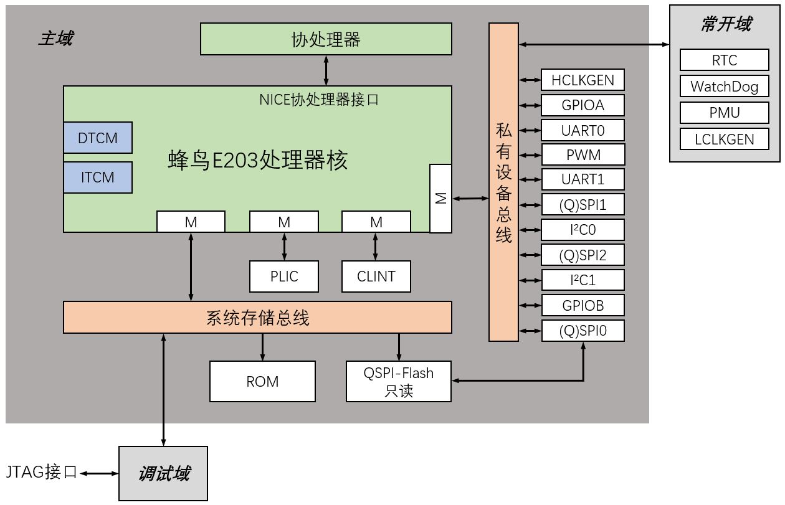
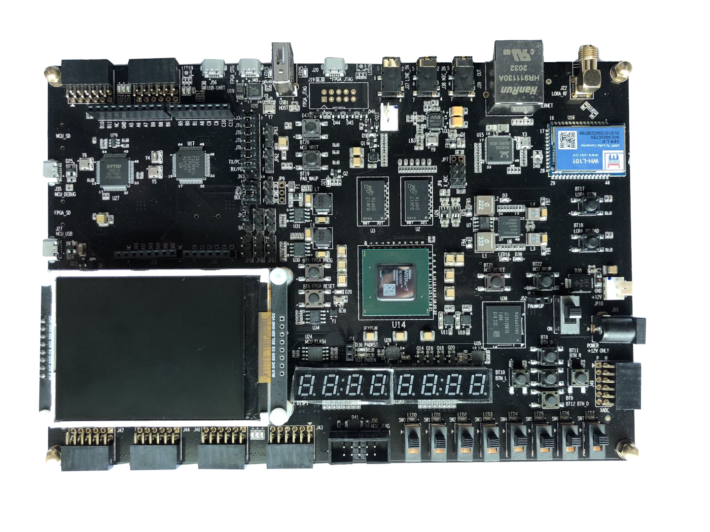
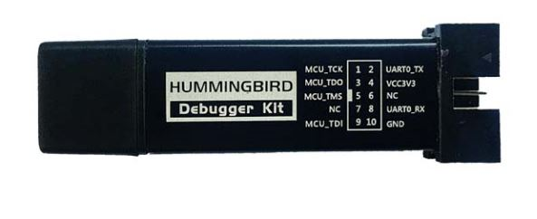

Hummingbirdv2 E203 Core and SoC 
===============================

About
-----

This repository hosts the project for open-source Hummingbirdv2 E203 RISC-V processor Core and SoC, it's developped and opensourced by [Nuclei System Technology](www.nucleisys.com), the leading RISC-V IP and Solution company based on China Mainland.

This's an upgraded version of the project Hummingbird E203 maintained in [SI-RISCV/e200_opensource](https://github.com/SI-RISCV/e200_opensource), so we call it Hummingbirdv2 E203, and its architecture is shown in the figure below.

In this new version, we have following updates.
* Add NICE(Nuclei Instruction Co-unit Extension) for E203 core, so user could create customized HW co-units with E203 core easily.
* Integrate the APB interface peripherals(GPIO, I2C, UART, SPI, PWM) from [PULP Platform](https://github.com/pulp-platform) into Hummingbirdv2 SoC, these peripherals are implemented in Verilog language, so it's easy for user to understand. 
* Add new development boards(Nuclei ddr200t and mcu200t) support for Hummingbirdv2 SoC. 

**Welcome to visit https://github.com/riscv-mcu/hbird-sdk/ to use software development kit for the Hummingbird E203.**

**Welcome to visit https://www.rvmcu.com/community.html to participate in the discussion of the Hummingbird E203.**

**Welcome to visit http://www.rvmcu.com/ for more comprehensive information of availiable RISC-V MCU chips and embedded development.**

Detailed Introduction and Quick Start-up
----------------------------------------

We have provided very detailed introduction and quick start-up documents to help you ramping it up. 

The detailed introduction and the quick start documentation can be seen 
from https://doc.nucleisys.com/hbirdv2/.

By following the guidences from the doc, you can very easily start to use Hummingbirdv2 E203 processor Core and SoC.

What are you waiting for? Try it out now!

Dedicated FPGA-Boards and JTAG-Debugger 
---------------------------------------

In order to easy user to study RISC-V in a quick and easy way, we have made dedicated FPGA-Boards and JTAG-Debugger.

#### Nuclei ddr200t development board

#### Nuclei mcu200t development board

#### Hummingbird Debugger

The detailed introduction and the relevant documentation can be seen from https://nucleisys.com/developboard.php.

HummingBird SDK
---------------

Click https://github.com/riscv-mcu/hbird-sdk for software development kit.

Release History
---------------

#### Notice

* **Many people asked if this core and SoC can be commercially used, the answer as below:**
  - According to the Apache 2.0 license, this open-sourced core can be used in commercial way.
  - But the feature is not full. 
  - The main purpose of this open-sourced core is to be used by students/university/research/
    and entry-level-beginners, hence, the commercial quality (bug-free) and service of this core
    is not not not warranted!!! 

#### Release 0.2.1, Feb 26, 2021

This is `release 0.2.1` of Hummingbirdv2.

+ Hbirdv2 SoC
  - Covert the peripheral IPs implemented in system verilog to verilog implementation.

+ SIM
  - Add new simulation tool(iVerilog) and wave viewer(GTKWave) support for Hummingbirdv2 SoC

#### Release 0.1.2, Nov 20, 2020

This is `release 0.1.2` of Hummingbirdv2.

+ Hbirdv2 SoC
  - Remove unused module
  - Add one more UART

+ FPGA
  - Add new development board(Nuclei mcu200t) support for Hummingbirdv2 SoC
 
#### Release 0.1.1, Jul 28, 2020

This is `release 0.1.1` of Hummingbirdv2.

NOTE:
  + This's an upgraded version of the project Hummingbird E203 maintained in
    [SI-RISCV/e200_opensource](https://github.com/SI-RISCV/e200_opensource).
  + Here are the new features of this release.
    - Add NICE(Nuclei Instruction Co-unit Extension) for E203 core
    - Integrate the APB interface peripherals(GPIO, I2C, UART, SPI, PWM) from PULP Platform
    - Add new development board(Nuclei ddr200t) support for Hummingbirdv2 SoC. 
