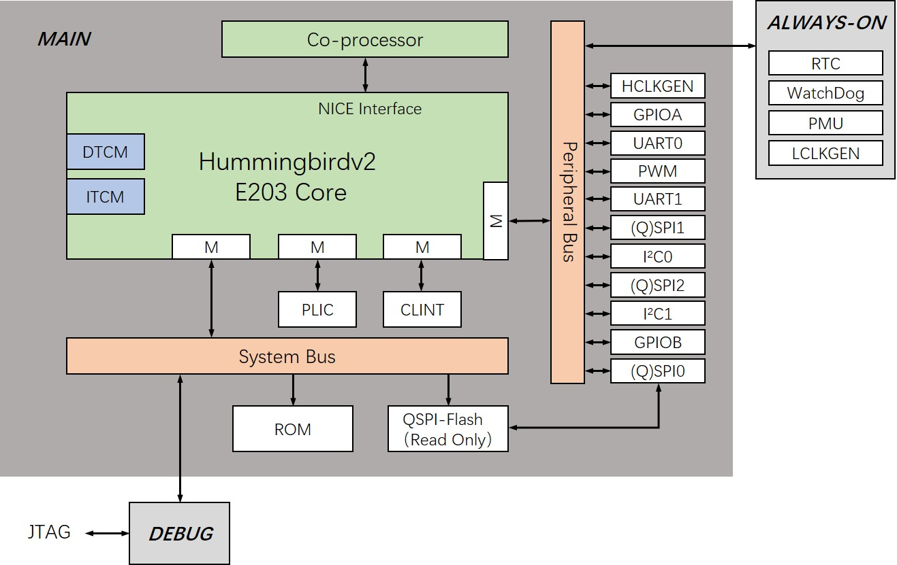

.. _overview:

Overview
========

Introduction
############

The Hummingbirdv2 E203 RISC-V processor core and SoC is developped and opensourced by `Nuclei System Technology <https://nucleisys.com>`__, the leading RISC-V IP and Solution company based on China Mainland.

It's an upgraded version of the project Hummingbird E203 maintained in `SI-RISCV/e200_opensource <https://github.com/SI-RISCV/e200_opensource>`__, so we called it Hummingbirdv2 E203 (HBirdv2 E203). The system architecture of Hummingbirdv2 E203 is shown in the block diagram below.

.. _figure_overview_1:

   System architecture of Hummingbirdv2 E203

In this new verison, we have following updates.

- Add NICE(Nuclei Instruction Co-unit Extension) for E203 core, so user could create customized HW co-units with E203 core easily.
- Integrate the APB interface peripherals(GPIO, I2C, UART, SPI, PWM) from `PULP Platform <https://github.com/pulp-platform>`__ into Hummingbirdv2 SoC, these peripherals are implemented in Verilog language, so it's easy for user to understand.
- Add new development boards(Nuclei ddr200t and mcu200t) support for Hummingbirdv2 SoC.

You can find a pdf version of this doc from https://doc.nucleisys.com/hbirdv2/hbirdv2_soc.pdf

**Welcome to visit** `HBird SDK <https://github.com/riscv-mcu/hbird-sdk/>`__ **to use software development kit for the Hummingbirdv2 E203.**

**Welcome to visit** `Hummingbird Forum <https://www.rvmcu.com/community-community.html>`__ **to participate in the discussion of the Hummingbirdv2 E203.**

**Welcome to visit** `RV MCU Community <http://www.rvmcu.com/>`__ **for more comprehensive information of availiable RISC-V MCU chips and embedded development.**

Hummingbirdv2 E203 Core
#######################
About the brief introduction of E203 RISC-V Core, please refer to :ref:`Hummingbirdv2 E203 Core <core>`.

Hummingbirdv2 SoC Peripherals
#############################
About the brief introduction of HBirdv2 SoC peripherals, please refer to :ref:`Hummingbirdv2 SoC Peripherals <ips>`.

Quick Start
###########
The steps about how to run tests in simulation environment and run SW applications in FPGA with HBirdv2 SoC ported, please refer to :ref:`Quick Start <quick_start>`. 

Copyright
#########

Copyright (c) 2020 - Present, Nuclei System Technology. All rights reserved.

Redistribution and use in source and binary forms, with or without modification,
are permitted provided that the following conditions are met:

1. Redistributions of source code must retain the above copyright notice, this
   list of conditions and the following disclaimer.

2. Redistributions in binary form must reproduce the above copyright notice,
   this list of conditions and the following disclaimer in the documentation
   and/or other materials provided with the distribution.

3. Neither the name of the Nuclei System Technology., nor the names of its contributors
   may be used to endorse or promote products derived from this software without
   specific prior written permission.

THIS SOFTWARE IS PROVIDED BY THE COPYRIGHT HOLDERS AND CONTRIBUTORS "AS IS" AND
ANY EXPRESS OR IMPLIED WARRANTIES, INCLUDING, BUT NOT LIMITED TO, THE IMPLIED
WARRANTIES OF MERCHANTABILITY AND FITNESS FOR A PARTICULAR PURPOSE ARE
DISCLAIMED. IN NO EVENT SHALL THE COPYRIGHT HOLDER OR CONTRIBUTORS BE LIABLE FOR
ANY DIRECT, INDIRECT, INCIDENTAL, SPECIAL, EXEMPLARY, OR CONSEQUENTIAL DAMAGES
(INCLUDING, BUT NOT LIMITED TO, PROCUREMENT OF SUBSTITUTE GOODS OR SERVICES;
LOSS OF USE, DATA, OR PROFITS; OR BUSINESS INTERRUPTION) HOWEVER CAUSED AND ON
ANY THEORY OF LIABILITY, WHETHER IN CONTRACT, STRICT LIABILITY, OR TORT
(INCLUDING NEGLIGENCE OR OTHERWISE) ARISING IN ANY WAY OUT OF THE USE OF THIS
SOFTWARE, EVEN IF ADVISED OF THE POSSIBILITY OF SUCH DAMAGE. NY THEORY OF
LIABILITY, WHETHER IN CONTRACT, STRICT LIABILITY, OR TORT (INCLUDING NEGLIGENCE
OR OTHERWISE) ARISING IN ANY WAY OUT OF THE USE OF THIS SOFTWARE, EVEN IF
ADVISED OF THE POSSIBILITY OF SUCH DAMAGE.

License
#######

HBirdv2 E203 is an opensource project licensed by :ref:`Apache License 2.0 <license>`.
