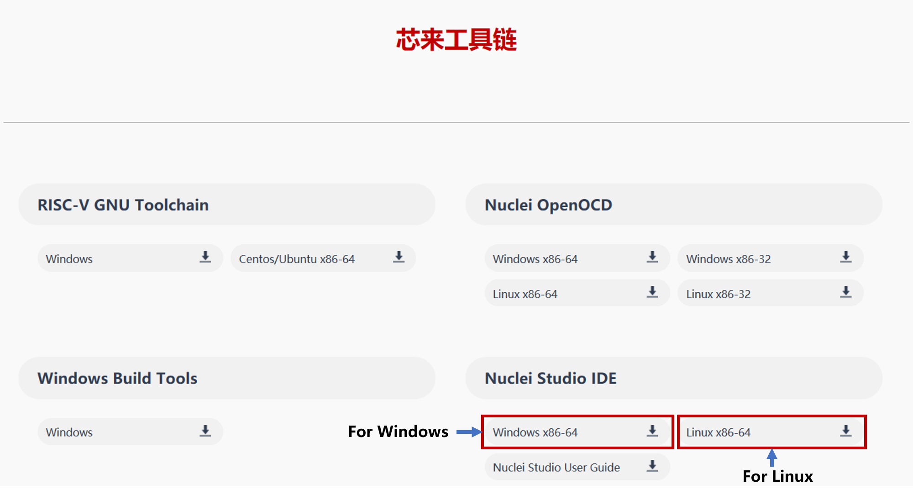
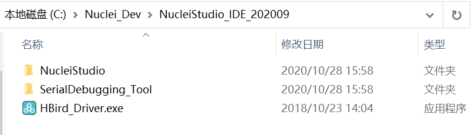

.. _ide:

How to develop with Nuclei Studio(Ver.2020-09)
==============================================

This chapter will introduce how to run Hello World demo on HBirdv2 E203 SoC with Nuclei Studio.

Nuclei Studio introduction
##########################

Nuclei Studio is an integrated development environment(IDE) developed by `Nuclei System Technology <https://nucleisys.com>`__ to support its self-developed processors(including commercial Nuclei series processors and open source HBird E203 processor). It's implemented based on the open source Eclipse framework, and fully integrated with Nuclei SDK(for commercial Nuclei series processors) and HBird SDK(for open source HBird E203 processor). Users could easily create new projects and modify project settings based on their requirements with Nuclei Studio. 

Install Nuclei Studio
#####################

Nuclei Studio could be downloaded from `Nuclei Download Center <https://nucleisys.com/download.php>`__.

.. _figure_ide_1:

   Nuclei Studio download 

.. note::
   
   - Nuclei Studio is available in Windows and Linux, here just take Nuclei Studio(Ver.2020-09) for Windows as example.
   - Nuclei Studio Ver.2022-04 and subsequent verison support new features(NPK), and the development flow is different with old verison, so if using Nuclei Stuido with 2022-04 or subsequent verison, please refer to :ref:`How to develop with Nuclei Studio(Ver.2022-04) <ide_latest>`.

Etract the downloaded package, there are three parts, shown in the figure below.

- NucleiStudio: Nuclei Studio IDE. 
- SerialDebugging_Tool: Serial Debugging tool for Windows.
- HBird_Driver.exe: HBird Debugger driver for Windows.

   Nuclei Studio package 

Creat Hello World Project
#########################

**1. Lanuch Nuclei Studio**

- Doubel-click *eclipse.exe* under **NucleiStudio** directory, shown in the figure below.

  .. figure:: ../asserts/medias/ide_fig3.png
     :width: 800
     :alt: ide_fig3
  
     Lanuch Nuclei Studio 

- Then setting workspace in the next window, shown in the figure below.

  .. figure:: ../asserts/medias/ide_fig4.png
     :width: 500
     :alt: ide_fig4
  
     Set Workspace

  .. note::

     Workspace is the directory used to store the projects you will create, so you can choose any directory in your working PC as you like.

- After workspace set, click the **Launch** button, Nuclei Studio will be launched, shown in the figure below.

  .. figure:: ../asserts/medias/ide_fig5.png
     :width: 800
     :alt: ide_fig5
  
     Welcome page

**2. Creat project**

- In the menu bar, select "File -> New -> C/C++ Project", shown in the figure below.

  .. figure:: ../asserts/medias/ide_fig6.png
     :width: 800
     :alt: ide_fig6
  
     New Project

- In the pop-up window, select "C Managed Build", then click "Next", shown in the figure below.

  .. figure:: ../asserts/medias/ide_fig7.png
     :width: 400
     :alt: ide_fig7
  
     New Project Type

- In next window, input "HelloWorld" as **Project name**, and select "HBird SDK Project For hbirdv2 e203 SoC", then click "Next", shown in the figure below.

  .. figure:: ../asserts/medias/ide_fig8.png
     :width: 400
     :alt: ide_fig8
  
     New Project Name

- In next window, "Board", "Core" and "DOWNLOAD", these project options could be set, here just keep them as default, and click "Next", shown in the figure below.

  .. figure:: ../asserts/medias/ide_fig9.png
     :width: 400
     :alt: ide_fig9
  
     New Project Options

- In next window, select "baremetal helloworld" as **Project Example**, and about other options just keep them as default, then click "Next", shown in the figure below.

  .. figure:: ../asserts/medias/ide_fig10.png
     :width: 800
     :alt: ide_fig10
  
     New Project Example 

- In the next steps, just keep them as default, then click "Next", finally click "Finish", shown in the figure below.

  .. figure:: ../asserts/medias/ide_fig11.png
     :width: 800
     :alt: ide_fig11
  
     Finish New Project Creat  

- The created project is shown in the figure below.

  .. figure:: ../asserts/medias/ide_fig12.png
     :width: 800
     :alt: ide_fig12
  
     Created HelloWorld Project

  .. note::

     From the **Project Explorer** on the left side of the figure, we can find that, the created project already includes HBird SDK, so users could develop other applications easily based on the created baremetal demo.

Compile Hello World Project
###########################

**1. Compile options setting**

- In the menu bar, select "RV-Tools -> SDK Configuration Tools", shown in the figure below.

  .. figure:: ../asserts/medias/ide_fig13.png
     :width: 800
     :alt: ide_fig13

     SDK Configuration Tools
  
- In the pop-up window, you can choose the download mode as you need, then click "Save" button, shown in the figure below.

  .. figure:: ../asserts/medias/ide_fig14.png
     :width: 400
     :alt: ide_fig14     

     Compile Options

**2. Compile HelloWorld demo**

- Click the "Build" button, the icon of this button is a hammer, shown in the figure below.
  
  .. figure:: ../asserts/medias/ide_fig15.png
     :width: 800
     :alt: ide_fig15

     Build Project

- After the project compiled successfully, it will shown as the figure below.
  
  .. figure:: ../asserts/medias/ide_fig16.png
     :width: 800
     :alt: ide_fig16

     Build finished

  .. note::

     - The generated executable file named "HelloWorld.elf" is located in **Debug** directory.
     - The code size and data size is also printed in the **Console** window. 

Run Hello World Project
#######################

**1. Hardward connection**

- Same as **Step1** in :ref:`Run Hello World demo with HBird SDK<quickstart_run_hello_world>`.

**2. Debugger driver install**

- Same as **Step2** in :ref:`Run Hello World demo with HBird SDK<quickstart_run_hello_world>`.

  .. note::
   
     If the Debugger driver has been installed successfully, don't need to install it again.

**3. Download and run**

- Open the created **Hello World** project, select "RV-Tools -> SDK Configuration Tools", choose "FLASH" as download mode, then click "Save" button, shown in the figure below.

  .. figure:: ../asserts/medias/ide_fig17.png
     :width: 400
     :alt: ide_fig17     

     Download Mode Setting 

- Click the "Build" button, compiling the project.

  .. figure:: ../asserts/medias/ide_fig18.png
     :width: 800
     :alt: ide_fig18     

     Build Project

- In the menu bar, select "Run -> Run Configuration", shown in the figure below.

  .. figure:: ../asserts/medias/ide_fig19.png
     :width: 800
     :alt: ide_fig19     

     Open Run Configuration 

- Double-click "GDB OpenOCD Debugging", then a set configuration file used for debug/download named "HelloWorld Debug" will be generated automatically, finally click "Run" button, shown in the figure below.

  .. figure:: ../asserts/medias/ide_fig20.png
     :width: 800
     :alt: ide_fig20

     Run Configuration file

  .. note::

     If the Run/Debug Configuration file already exists, don't need to generate again.

- After the program uploaded successfully, it will shown as the figure below.

  .. figure:: ../asserts/medias/ide_fig21.png
     :width: 800
     :alt: ide_fig21

     Download Complete

**4. Run result**

- In the menu bar, select "Window -> Show View -> Terminal", then click the "Open a Terminal" button in **Terminal** window, the icon of this button is a monitor, shown in the figure below.

  .. figure:: ../asserts/medias/ide_fig22.png
     :width: 800
     :alt: ide_fig22

     Open Terminal

- In the pop-up window, choose "Serial Terminal", and set other parameters as following figure shown.
 
  .. figure:: ../asserts/medias/ide_fig23.png
     :width: 300
     :alt: ide_fig23

     Config Terminal

  .. note::

     The serial port number depends on your device.

- After Serial Terminal opened, you can press the **MCU_RESET** button on Nuclei ddr200t development board to reset MCU and the Hello World program will be executed again, the result is shown in the figure below.

  .. figure:: ../asserts/medias/ide_fig24.png
     :width: 800
     :alt: ide_fig24

     Hello World Demo Result 

Debug Hello World Project
#########################

**1. Hardward connection**

- Same as **Step1** in :ref:`Run Hello World demo with HBird SDK<quickstart_run_hello_world>`.

**2. Debugger driver install**

- Same as **Step2** in :ref:`Run Hello World demo with HBird SDK<quickstart_run_hello_world>`.

  .. note::
     
     If the Debugger driver has been installed successfully, don't need to install it again.

**3. Debug**

- Open the created **Hello World** project, click the "Build" button, compiling the project.
  
  .. note::
     
     Debugging program need to set download mode as "ILM", since the newly created **Hello World** project already sets "ILM" as default download mode, so we don't need to do any changes before compiling. If the download mode has been changed by yourself, please make sure it should be set to "ILM" when you want to debug program.

- In the menu bar, select "Run -> Debug Configuration", shown in the figure below.

  .. figure:: ../asserts/medias/ide_fig25.png
     :width: 800
     :alt: ide_fig25

     Open Debug Configuration 

- Double-click "GDB OpenOCD Debugging", then a set configuration file used for debug/download named "HelloWorld Debug" will be generated automatically, finally click "Debug" button, shown in the figure below.

  .. figure:: ../asserts/medias/ide_fig26.png
     :width: 800
     :alt: ide_fig26

     Debug Configuration file

  .. note::

     If the Run/Debug Configuration file already exists, don't need to generate again.

- After entering debugging mode successfully, it will shown as the figure below.

  .. figure:: ../asserts/medias/ide_fig27.png
     :width: 800
     :alt: ide_fig27

     Debugging Mode
