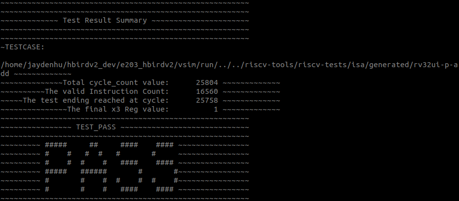
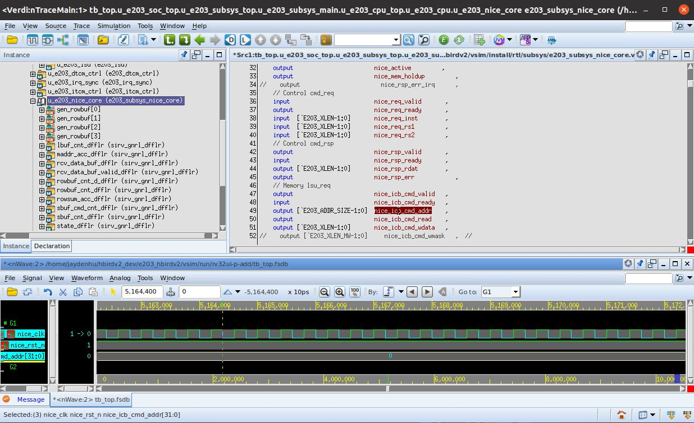
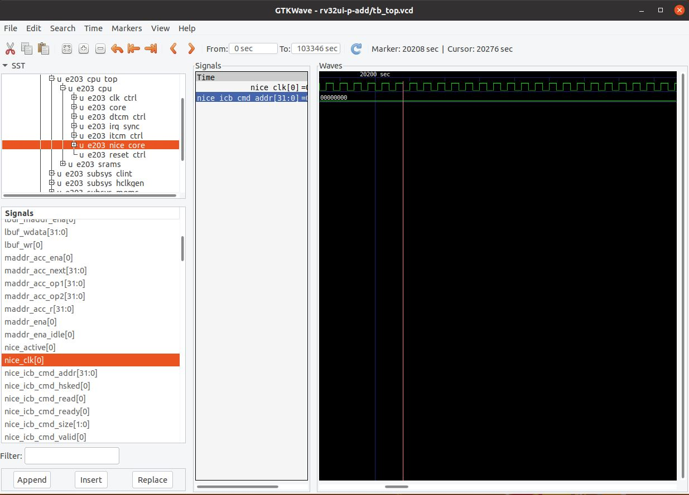

.. _sim:

How to run simulation
=====================

This chapter will introduce how to run system level simulation test on HBirdv2 E203.

.. _get_ready:

Get ready
#########

**1. Setup environment**

- Recommended Linux system: 
    
  .. code-block:: shell

     Ubuntu 18.04

- Required tools:

  .. code-block:: shell
      
     sudo apt-get install autoconf automake autotools-dev curl device-tree-compiler libmpc-dev libmpfr-dev libgmp-dev
     gawk build-essential bison flex texinfo gperf libtool patchutils bc zlib1g-dev git

**2. Download e203_hbirdv2 project**

   .. code-block:: shell
      
      git clone https://github.com/riscv-mcu/e203_hbirdv2.git

   or

   .. code-block:: shell

      git clone https://gitee.com/riscv-mcu/e203_hbirdv2.git

   .. note::
      After this step, the project is cloned, and the complete e203_hbirdv2 directory is available on this machine. Assuming that the directory is <your_e203_dir>, the abbreviation will be used in the following text.

Compile self-test cases
#######################

**1. Install RISC-V GNU toolchain**

- Download RISC-V GNU toolchain from `Nuclei Download Center <https://nucleisys.com/download.php>`__.

  .. _figure_sim_1:

  .. figure:: ../asserts/medias/sim_fig1.png
     :width: 800
     :alt: sim_fig1

     RISC-V GNU Toolchain

- Configure for riscv-tests

  .. code-block:: shell
      
     cp rv_linux_bare_9.21_centos64.tgz.bz2 ~/
             
     cd ~/

     tar -xjvf rv_linux_bare_9.21_centos64.tgz.bz2
     
     cd <your_e203_dir>/
     
     mkdir -p ./riscv-tools/prebuilt_tools/prefix/bin
     
     cd ./riscv-tools/prebuilt_tools/prefix/bin/
     
     ln -s ~/rv_linux_bare_19-12-11-07-12/bin/* .

  .. note::
     rv_linux_bare_9.21_centos64.tgz.bz2 is a sample version, the name depends on the specific version when downloading.

**2. Compile tests**

.. code-block:: shell

   cd <your_e203_dir>/riscv-tools/riscv-tests/isa

   source regen.sh

.. note::
   In <your_e203_dir>/riscv-tools/riscv-tests/isa/generated directory, there are pre-generated executable files.
   If the test codes have been changed, just using above commands could regenerate executable files.

Run simulation tests
####################

**1. Compile RTL**

.. code-block:: shell

   cd <your_e203_dir>/vsim
   
   make clean

   make install
        
   // For VCS:
   make compile SIM=vcs

   // For iVerilog:
   make compile SIM=iverilog 

.. note::
   1. Here we use iVerilog+GTKWave for simulation by default, and VCS+Verdi are also supported in simulation environment, you can choose the simulation tool by Makefile variable **SIM**. If you want to run simulation tests directly, please make sure these EDA tools are installed in your working environment. 

   2. If you use iVerilog as simulation tool, please make sure the tool verison is 12.0.

**2. Run default testcase**

.. code-block:: shell
   
   // For VCS:
   make run_test SIM=vcs

   // For iVerilog:
   make run_test SIM=iverilog 

.. _figure_sim_2:

   Default test simulation result

**3. Show waveform**

.. code-block:: shell

   // Using Verdi:
   make wave SIM=vcs

   // Using GTKWave:
   make wave SIM=iverilog 

.. note::
   The combination of simulation tool and waveform viewer is fixed in Makefile.

   - VCS + Verdi
   - iVerilog + GTKWave

.. _figure_sim_3:

   Waveform with Verdi 

.. _figure_sim_4:

   Waveform with GTKWave

**4. Run regression**

.. code-block:: shell

   // For VCS:
   make regress_run SIM=vcs

   // For iVerilog:
   make regress_run SIM=iverilog 

**5. Check regression result**

.. code-block:: shell

   make regress_collect

Regression result is printed as shown in the figure below.

.. _figure_sim_5:

.. figure:: ../asserts/medias/sim_fig5.png
   :width: 800
   :alt: sim_fig5

   Regression result

